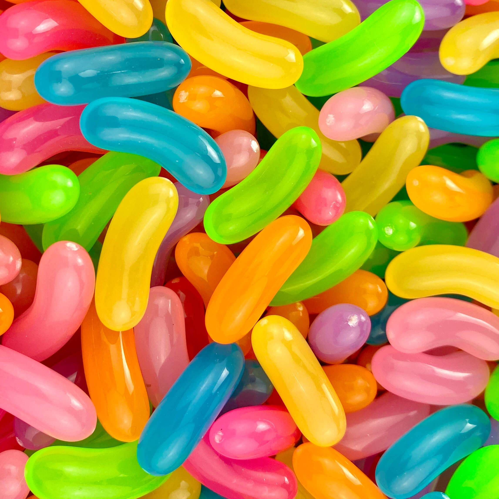
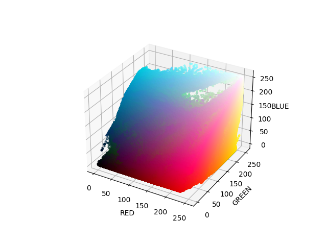
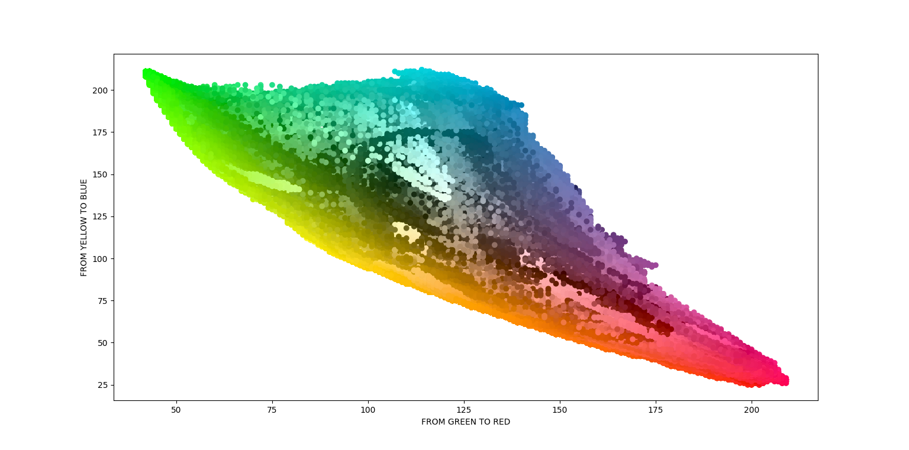
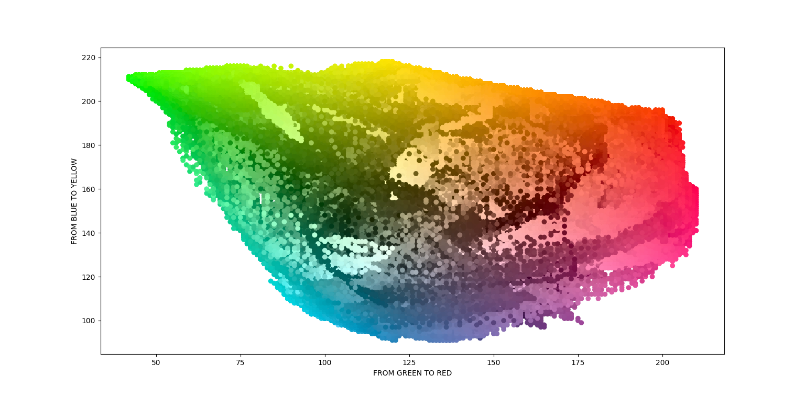

<h1>PROJECT: Color Segmentation Scatterplot</h1>
Python script that puts all the colors in an image in a scatterplot. Utilized Matplotlib, OpenCV and numpy

I used a cluttered photo of jellybeans posted below. 

These are the outpits

